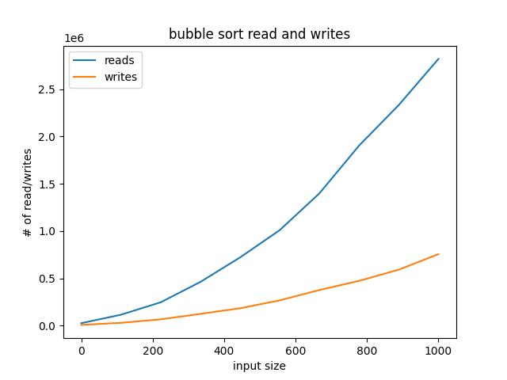
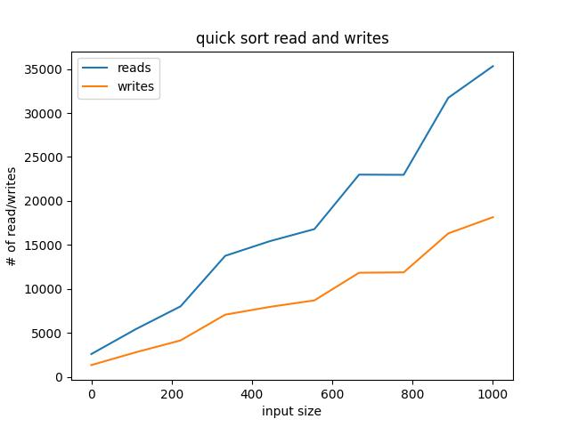

**Hayden Collins M3AP** 

1. Bubble Sort

   Bubble sort has time complexity of 𝑂(𝑛2), which can be seen by the exponential graph below. It is one of the worse performing sorting algorithms tested here.
   
2. Selection Sort

   Selection sort also has a time complexity of 𝑂(𝑛2), however it is designed to make the fewest swaps possible, making it the best performing in terms of writes.
   
3. Quicksort.

   Quick sort has a time complexity of 𝑂(𝑛𝑙𝑜𝑔(𝑛)), outperforming both bubble and selection sort by a considerable margin.
   
4. Heap Sort

   Heap sort also has a time complexity of 𝑂(𝑛𝑙𝑜𝑔(𝑛)). However, it was outperformed by quicksort in my testing, although not by a massive margin (at least relative to bubble or another 𝑂(𝑛2)
algorithm).

   
5. Two sort
   I arbitrarily chose to do heap sort followed by bubble sort, as bubble sort was one of the simpler algorithms to modify. As you would expect, sorting with two separate algorithms, one of which
   being 𝑂(𝑛2) leads to a massive amount of reads/writes.

   

6. If you need to sort a contacts list on a mobile app, which sorting algorithm(s) would you use and why?
   Radix sort would be optimal because it can sort lexicographically, which is necessary for a contact list of strings.
7. If you need to sort a database of 20 million objects stored in a datacenter in the cloud, which sorting algorithm(s) would you use and why?
   Quicksort was the best performing, sometimes by a large margin.
